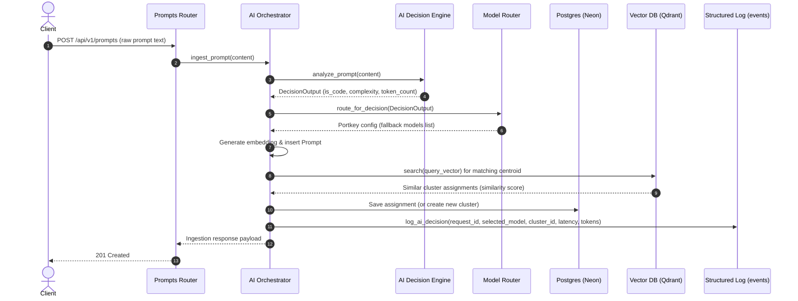
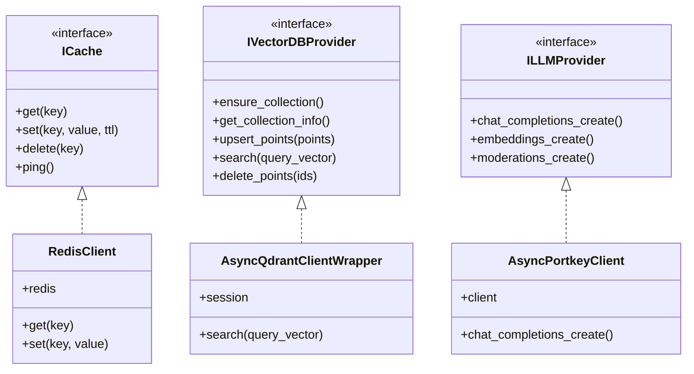

# Enterprise AI Prompt Governance Platform: Architecture Guide

This document describes the updated clean architecture of the **AI Prompt Governance Platform**. Every service is structured around interface-based dependency injection, allowing infrastructure parts (caching layers, vector indices, model client gateways) to be decoupled from core business logic.

---

## 1. System Architecture Diagram

```mermaid
graph TD
    Client[Client / FastAPI Router] --> |Trigger Ingestion| Orchestrator[AI Orchestrator]
    
    subgraph Core Decision & Routing
        Orchestrator --> |Analyze Content| DecisionEngine[AI Decision Engine]
        Orchestrator --> |Select Models| ModelRouter[Model Router]
        ModelRouter --> |Consume Analysis| DecisionEngine
    end
    
    subgraph Execution & Governance Layers
        Orchestrator --> |Version Templates| LineageEngine[Prompt Lineage Engine]
        Orchestrator --> |Assess Performance| EvaluationEngine[Evaluation Engine]
    end
    
    subgraph Decoupled Infrastructure (PaaS)
        LineageEngine --> |Write DB| NeonDB[(Neon PostgreSQL)]
        EvaluationEngine --> |Query Assignments| NeonDB
        Orchestrator --> |Cache Embeddings| Upstash[(Upstash Redis)]
        Orchestrator --> |Search Centroids| Qdrant[(Qdrant Cloud)]
    end
    
    subgraph Periodic Triggers
        JobScheduler[Job Scheduler] --> |Drift Checking| Orchestrator
        JobScheduler --> |Evaluation Analytics| EvaluationEngine
    end
```

---

## 2. Component Directory

| Module | Location | Responsibility |
| :--- | :--- | :--- |
| **Interfaces** | `src/interfaces/` | Abstract Base Classes (`ICache`, `IVectorDBProvider`, `IEmbeddingProvider`, `ILLMProvider`) enforcing strict interface boundaries. |
| **AI Orchestrator** | `src/services/orchestrator.py` | Central controller that coordinates parsing, moderation, clustering, lineage recording, and metric calculations. |
| **AI Decision Engine** | `src/services/decision_engine.py` | Local, high-performance rule engine that estimates tokens, detects code/natural language, and classifies workload categories. |
| **Model Router** | `src/services/model_router.py` | Router that consumes the Decision Engine's output to build dynamic Portkey routing parameters and fallback lists. |
| **Prompt Lineage Engine** | `src/services/lineage.py` | Version control engine for canonical templates, tracking semantic drift evolution, and linking parent-child prompt trees. |
| **Evaluation Engine** | `src/services/evaluation.py` | Compiles cluster purity, merge accuracies, false merge thresholds, model latencies, and transaction costs. |
| **Job Scheduler** | `src/services/scheduler.py` | Async task registry that executes periodic drift checks, database garbage collections, and platform metrics compiling. |

---

## 3. Sequence Diagram (Ingestion Workflow)



---

## 4. Class Diagram & Interface Boundaries



---

## 5. Interface-Based Dependency Injection Example

To maintain low coupling, services request interfaces rather than concrete clients:

```python
class EmbeddingService:
    def __init__(
        self,
        llm_client: ILLMProvider,    # Decoupled Portkey Client
        cache_client: ICache,        # Decoupled Redis Cache
    ):
        self.llm = llm_client
        self.cache = cache_client
```
This enables swapping Redis for Memcached, or Qdrant for Pinecone/Milvus, without modifying any business logic inside the embedding or clustering pipeline.
